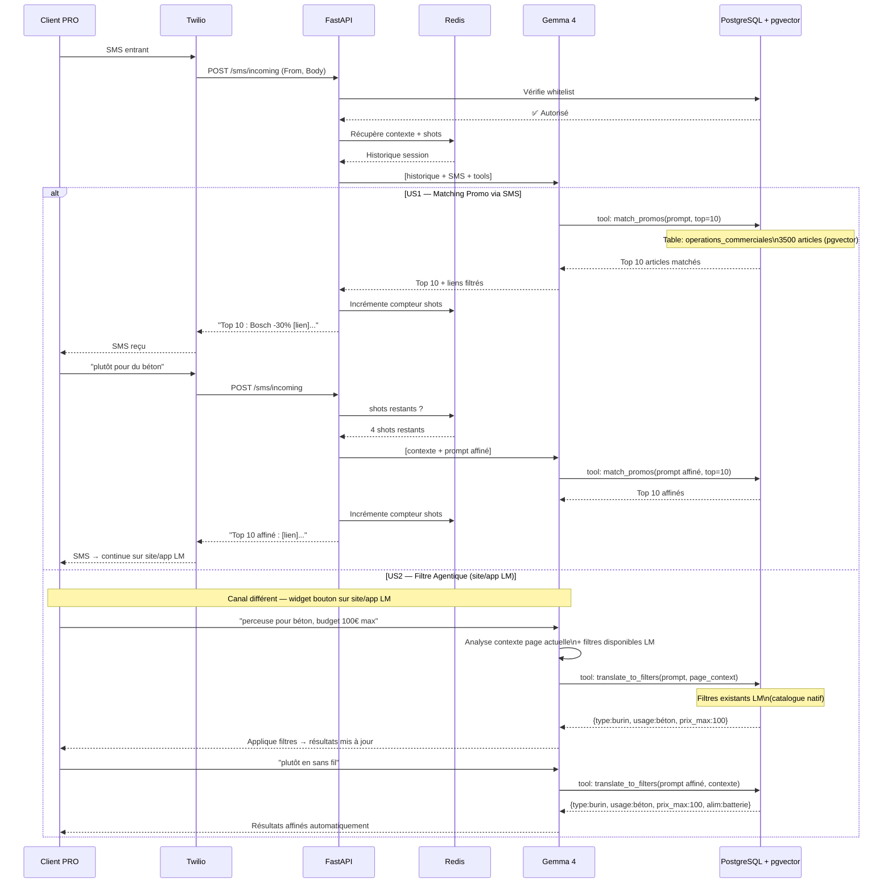

# RenoAssistant — Diagramme de Séquence

> Utiliser sur https://mermaid.live ou dans tout fichier Markdown.

---

## Séquence Globale — US1 + US2

---

*Visualiser sur [mermaid.live](https://mermaid.live)*
